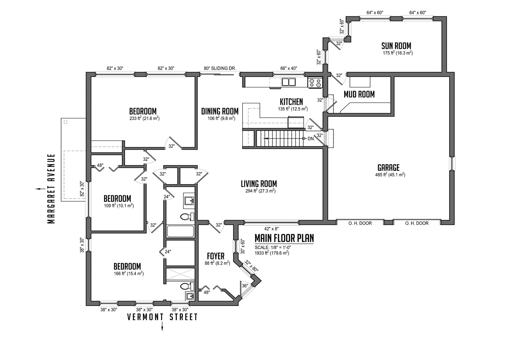
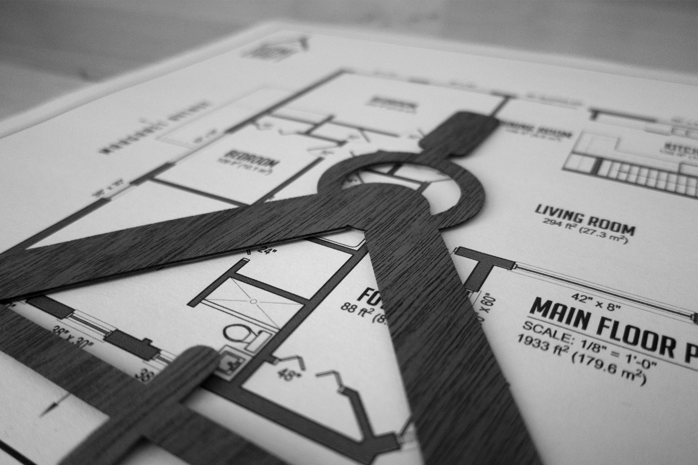

In April 2012, the City of Waterloo implemented [by-law 2011-047](http://www.waterloo.ca/en/government/residentialrentallicences.asp) requiring all low rise rental houses to be licensed. The purpose of the by-law is to ensure that rentals are safe and habitable, particularly when it comes to student rentals. According to the by-law, one of the requirements of the license application is a set of floor plans that identifies:

i) all rooms, spaces or common areas;

ii) how each room, space or common area shall be used, which means specifically indicating where all Bedrooms will be located on the floor plan; and,

iii) the dimensions (in square meters) of all rooms, spaces or common areas.

Home Craft is now offering services to create residential rental license floor plans satisfying all the municipalities requirements for inclusion in your application. Our floor plans are clear, concise, and drafted from accurate laser measurements obtained during an initial site visit. If you need help with your rental application, get in touch!
